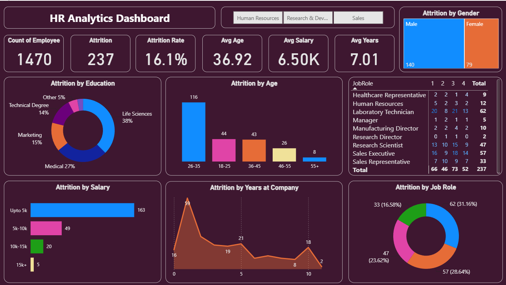

# 📊 HR Analytics Dashboard | Power BI

An interactive **HR Analytics Dashboard built with Microsoft Power BI** to analyze employee attrition and understand workforce patterns across departments, age groups, gender, education, salary, job roles, and years at the company.

The dashboard is designed to convert HR data into clear, interactive visual insights that can support workforce analysis and decision-making.

---

## 📸 Dashboard Preview



---

## 📌 Project Overview

Employee attrition is an important HR metric because frequent employee turnover can affect workforce stability, recruitment costs, productivity, and organizational planning.

This project analyzes employee attrition using an interactive Power BI dashboard. It provides an overview of the workforce and allows users to explore attrition patterns across multiple employee attributes.

The dashboard includes department-level filtering for:

- Human Resources
- Research & Development
- Sales

---

## 🎯 Project Objectives

The main objectives of this project are to:

- Analyze overall employee attrition.
- Calculate and display important HR KPIs.
- Identify attrition patterns across different age groups.
- Compare attrition by gender and education.
- Analyze attrition across salary ranges.
- Understand attrition in relation to years at the company.
- Compare attrition across different job roles.
- Provide an interactive dashboard for HR analysis.
- Present complex employee data in an easy-to-understand visual format.

---

## 📊 Key Performance Indicators

| KPI | Value |
|---|---:|
| 👥 Total Employees | **1,470** |
| 🚪 Employees with Attrition | **237** |
| 📉 Attrition Rate | **16.1%** |
| 🎂 Average Age | **36.92** |
| 💰 Average Salary | **6.50K** |
| 🏢 Average Years at Company | **7.01** |

> These values represent the data shown in the dashboard preview.

---

## 📈 Dashboard Analysis

### 1. Employee Overview

The KPI cards at the top of the dashboard provide a quick summary of the workforce:

- Total number of employees
- Total employee attrition
- Overall attrition rate
- Average employee age
- Average salary
- Average years at the company

This gives users an immediate overview before exploring individual dimensions.

---

### 2. Attrition by Gender

The gender visualization shows the number of employees who experienced attrition by gender.

This allows HR teams to compare attrition counts between male and female employees.

---

### 3. Attrition by Education

The education analysis breaks down attrition across different educational backgrounds, including:

- Life Sciences
- Medical
- Marketing
- Technical Degree
- Other

This helps explore whether attrition counts vary across educational backgrounds.

---

### 4. Attrition by Age

Employees are grouped into different age ranges:

- 18–25
- 26–35
- 36–45
- 46–55
- 55+

The visualization helps identify which age groups contribute most to overall attrition.

---

### 5. Attrition by Salary

The salary analysis groups employees into salary ranges:

- Up to 5K
- 5K–10K
- 10K–15K
- 15K+

This provides a visual comparison of attrition counts across salary categories.

---

### 6. Attrition by Years at Company

The years-at-company visualization examines how attrition varies with employee tenure.

This can help identify patterns among employees with different lengths of service.

---

### 7. Attrition by Job Role

The dashboard compares attrition across multiple job roles, including:

- Healthcare Representative
- Human Resources
- Laboratory Technician
- Manager
- Manufacturing Director
- Research Director
- Research Scientist
- Sales Executive
- Sales Representative

This allows users to explore which roles have different levels of employee attrition.

---

### 8. Department Analysis

The dashboard provides department filters for:

- **Human Resources**
- **Research & Development**
- **Sales**

Selecting a department updates the dashboard visuals, making it possible to perform department-level analysis.

---

## 🛠️ Tools & Technologies

### Power BI
Used to build the interactive dashboard and data visualizations.

### Power Query
Used for data preparation, transformation, and cleaning.

### DAX
Used for calculated measures and KPI calculations.

### Data Visualization
Used charts, KPI cards, filters, and interactive visuals to communicate HR insights effectively.

---

## 🧠 Skills Demonstrated

This project demonstrates practical experience in:

- Data Cleaning
- Data Transformation
- Data Analysis
- Data Visualization
- Power BI Dashboard Development
- Power Query
- DAX
- KPI Development
- Interactive Filtering
- Business Intelligence
- HR Analytics
- Dashboard Design
- Insight Communication

---

## 📂 Repository Structure

```text
HR-Analytics-PowerBI/
│
├── HR_Analytics_Dashboard.pbix
├── README.md
├── LICENSE
│
└── images/
    └── HR_Analytics_Dashboard.png
```

---

## 🚀 How to Use the Dashboard

### Step 1 — Clone the repository

```bash
git clone https://github.com/Pratikxdev/HR-Analytics-PowerBI.git
```

### Step 2 — Open the project

Open:

```text
HR_Analytics_Dashboard.pbix
```

using **Microsoft Power BI Desktop**.

### Step 3 — Refresh the data

If Power BI asks for a data-source location, update the source path according to your local dataset location and refresh the model.

### Step 4 — Explore the dashboard

Use the department filters and dashboard visuals to explore different employee attrition patterns.

---

## 💡 Business Questions Addressed

This dashboard can be used to explore questions such as:

1. What is the overall employee attrition rate?
2. How many employees have left the organization?
3. Which age groups have higher attrition counts?
4. How does attrition vary by gender?
5. How does attrition differ across education backgrounds?
6. How does attrition vary across salary ranges?
7. How does employee tenure relate to attrition?
8. Which job roles have different levels of attrition?
9. How do attrition patterns change across departments?

---

## 📌 Key Observations

Based on the dashboard shown in this project:

- The dataset contains **1,470 employees**.
- **237 employees** are represented in the attrition count.
- The overall displayed attrition rate is **16.1%**.
- The displayed average employee age is **36.92 years**.
- The displayed average salary is **6.50K**.
- The displayed average years at the company is **7.01 years**.
- Attrition is visualized across demographic, educational, compensation, tenure, and job-role dimensions.

> **Important:** These observations describe patterns visible in the dashboard. They should not be interpreted as proof that a particular employee characteristic causes attrition.

---

## 📊 Dashboard Features

| Feature | Description |
|---|---|
| KPI Cards | Quick overview of major HR metrics |
| Department Filter | Analyze departments separately |
| Gender Analysis | Compare attrition by gender |
| Education Analysis | Explore attrition by education |
| Age Analysis | Analyze attrition by age group |
| Salary Analysis | Compare attrition by salary range |
| Tenure Analysis | Explore attrition by years at company |
| Job Role Analysis | Compare different job roles |
| Interactive Visuals | Explore data dynamically |

---

## 🎓 Project Purpose

This project was created as a **Power BI data analytics portfolio project** to demonstrate practical skills in:

**Data → Transformation → Analysis → Visualization → Business Insights**

It focuses on presenting HR data in a format that is easy for business users to understand and explore.

---

## ⚠️ Data & Disclaimer

This dashboard is intended for **educational, portfolio, and analytical demonstration purposes**.

The dashboard shows relationships and patterns within the available dataset. It does not establish causal relationships between employee characteristics and attrition.

If the underlying dataset is sourced from a third party, please verify its license and redistribution terms before publishing the raw dataset to GitHub.

---

## 👨‍💻 Author

### Pratik Kumar Prajapati

**B.Tech – Computer Science & Engineering**

Aspiring **Data Analyst** with hands-on experience in:

`Python` • `SQL` • `Excel` • `Power BI` • `Pandas` • `Matplotlib` • `Data Analysis` • `Data Visualization`

### GitHub

[](https://github.com/Pratikxdev)

---

## ⭐ Feedback

If you find this project useful, feel free to explore the repository and review the dashboard.

---

### 📌 Tags

`Power BI` `HR Analytics` `Data Analytics` `Data Visualization` `DAX` `Power Query` `Business Intelligence` `Employee Attrition` `Dashboard` `Data Analysis`
